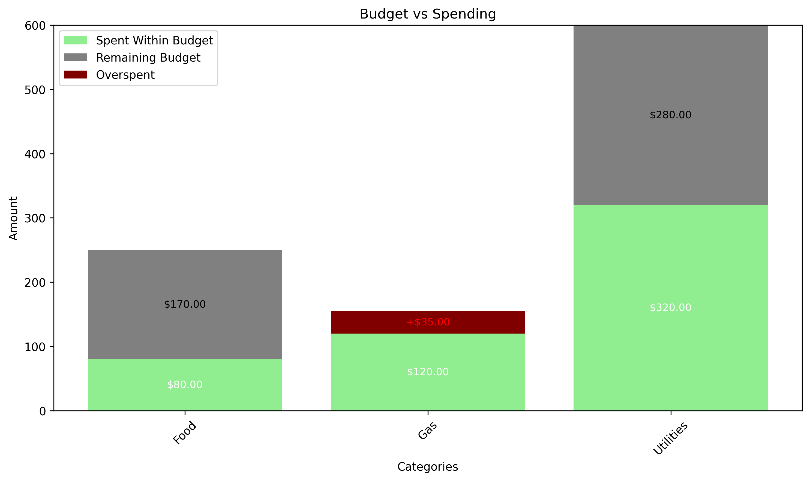

# Budget Assistant: Pocket Money

## Download Software

Open a terminal and navigate to the directory you would like to install Pocket Money.

```git
git clone https://github.com/Braxton-W/Pocket-Money PocketMoney
```

## Deploy

1. Open a terminal and navigate to the PocketMoney directory.

2. Create a virtual environment.

```ps
python -m venv .venv .venv\Scripts\Activate.ps1
```

3. Start the application.

```ps
python path/to/app.py
```

4. Open the webpage and begin use. Navigate to http://127.0.0.1:5000/ on a web browser.

## Description
Pocket Money is a lightweight budget tracker built with Python, Flask, and SQLAlchemy. Designed for individuals who want to take control of their finances without the clutter, it provides a clean interface for categorizing and tracking expenses and monitoring your net balance.

It's friendly to both technically experienced users and users who just want the features of the app without the hassle of coding: it can be used both through an API and through a user-friendly website!

After installation, the first thing to do is to setup categories such as Food, Entertainment, Rent, and Utilities, and assign a budget for each. Then you're ready to track your expenses! After that, you're ready to track! Whenever you're ready, you can enter in a purchase you made on the "Log Purchase" panel. You'll be asked to name it, what category it is in, and how much it was. For example, if I paid a $70 electric bill, I would add this purchase to Utilities. Then it's time to see the real magic of Pocket Money! Pocket Money will add this information to the database and then you can either make an API call or navigate to the homepage on the website, where your budget will update in real time. The price of your purchase will be subtracted from the assigned category's budget. So if my utilities budget was $100, I would now have a remaining total of $30 in utilities. Be sure not to let your balance run into the negatives-- that's not good! To help ensure that doesn't happen, Pocket Money will automatically generate visually friendly graphs of your budget and purchases. You can optionally reset all budgets and expenses using the "Monthly Reset" button available to you in the bottom left of the website.

## Visuals



## Authors

- Emma Machle
- Faisal Mangal
- Alex Pawlush
- Jonathan Walthour
- Braxton Worsley